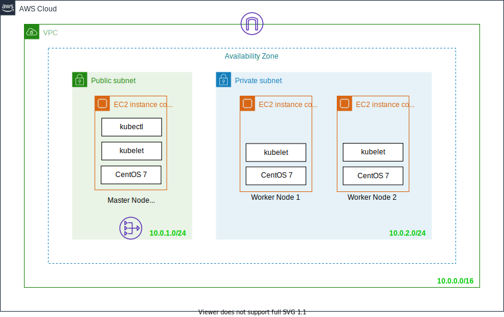

# Kubernetes Workshop
この Workshop では、kubeadm を利用して Kubernetes をインストールし、Kubernetes の基礎的な使い方を学習します。

## Kubernetes Workshop 環境構成図

## 想定学習時間
このコンテンツは、1 つのセクションが 2 時間程度で完了するように構成されています。  
全てのセクションを完了するのに、4 時間程かかることを見込んでください。

## コンテンツ

### Section.1 Kubernetes のインストール
- [Section.1 Kubernetes をインストールする](Section1/Readme.md)

### Section.2 Kubernetes リソースを理解する
- [Section.2-1 Pod](Section2-1/Readme.md)
- [Section.2-2 Replicaset](Section2-2/Readme.md)
- [Section.2-3 Deployment](Section2-3/Readme.md)
- [Section.2-4 Service](Section2-4/Readme.md)

### Note
この Workshop で問題が見つかった場合には、issue でコメントをお願いします。
